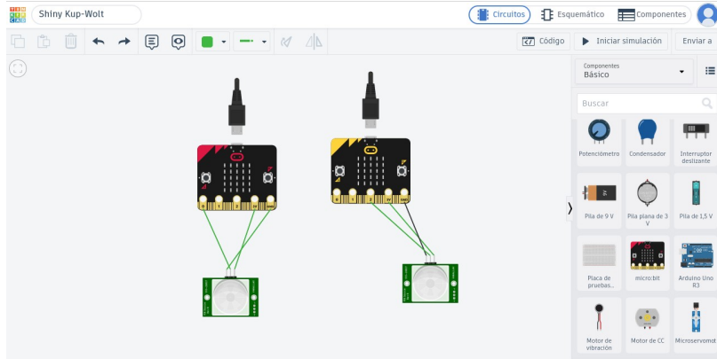

# ALL DETECTED

### Sistema inteligente de detección de movimiento y alertas mediante micro:bit y sensores, pensado para el monitoreo y seguridad de espacios, con posibilidad de incorporar nuevas funcionalidades en el futuro.


Este proyecto se realiza durante el curso **Laboratorio STEAM+**, correspondiente a la tecnicatura **Redes y Software** del Instituto Tecnológico de Informática de UTU.

## Integrantes

- Rafael Nunes
- Damian Marquez
- Simón Burgues
- Lucas Belen

# Documentación

## Informe de Avance 1 — Agosto 2026

### 13/08/2026 — Primera clase

Durante la primera clase se compartieron diferentes ideas para definir el proyecto a desarrollar. Luego de analizar las propuestas, se llegó al acuerdo de realizar un sistema de detección de movimiento utilizando **dos micro:bit y dos sensores PIR**.

La idea inicial consiste en utilizar los sensores para detectar movimiento dentro de un espacio representado mediante una maqueta. Cuando uno de los sensores detecte movimiento, la micro:bit correspondiente enviará una señal de alerta a la segunda micro:bit. De esta manera, se busca simular un sistema de monitoreo entre dos apartamentos o espacios separados.

En esta primera instancia también se seleccionaron los materiales principales que serán utilizados.

### Materiales iniciales

- 2 micro:bit
- 2 sensores PIR
- Cables de conexión
- 2 maquetas para representar los apartamentos
- Otros materiales a definir según el avance del proyecto

Las maquetas permitirán realizar una demostración visual del funcionamiento del sistema y facilitar las pruebas durante las distintas etapas del proyecto.

---

## 20/08/2026 — Segunda clase

Durante la segunda clase se comenzó a trabajar con **Tinkercad** para realizar pruebas y analizar posibles conexiones entre los componentes. Esta etapa permitió visualizar cómo podrían conectarse los diferentes elementos del proyecto y detectar qué materiales y conexiones serán necesarios para realizar el montaje físico.

Se realizaron diferentes ensayos relacionados con las conexiones y el uso de cables, con el objetivo de tener una primera aproximación al armado del sistema antes de realizar las pruebas con los componentes físicos.

También se comenzó a organizar el proyecto mediante **GitHub**, creando y configurando el repositorio que será utilizado por los integrantes del grupo para compartir el código, la documentación y los avances.

### Pruebas y simulaciones



La simulación permite visualizar una primera aproximación a la distribución y conexión de los componentes que formarán parte del sistema.

---

## Primer bosquejo del código

Como parte del avance se realizó un primer bosquejo del programa para la micro:bit. La lógica inicial consiste en leer el sensor PIR y, cuando se detecta movimiento, enviar mediante radio un mensaje de alerta a la otra micro:bit.

### Funcionamiento básico

1. Configurar la comunicación por radio.
2. Leer el sensor PIR.
3. Detectar si existe movimiento.
4. Enviar el mensaje de alerta a la otra micro:bit.
5. Recibir el mensaje en la segunda micro:bit.
6. Mostrar una señal visual y sonora para indicar la detección.

El código se encuentra todavía en una etapa inicial y podrá modificarse a medida que se realicen las pruebas con los componentes físicos y se incorporen nuevas funcionalidades.

### Código inicial — MicroPython

```python
from microbit import *
import radio
import audio

# 1. Configurar y activar la radio
radio.config(group=1)
radio.on()

# Definir una imagen personalizada de alerta
ALERTA_IMG = Image("99999:"
                   "90009:"
                   "90909:"
                   "90009:"
                   "99999")

while True:
    # 2. Leer el sensor PIR
    # El sensor PIR da un "1" (True) cuando detecta movimiento
    if pin0.read_digital():
        # Enviar mensaje de alerta a la otra micro:bit
        radio.send("MOVIMIENTO")

        # Activar alerta local
        display.show(ALERTA_IMG)
        audio.play(Sound.GIGGLE)
        sleep(2000)
        display.clear()

    # 3. Revisar si llegó un mensaje de la otra micro:bit
    mensaje_recibido = radio.receive()

    if mensaje_recibido == "MOVIMIENTO":
        # Activar alerta por aviso remoto
        display.show(ALERTA_IMG)
        audio.play(Sound.GIGGLE)
        sleep(2000)
        display.clear()

    sleep(100)
```

---

## Diagrama del funcionamiento

El funcionamiento general planteado es:

**Sensor PIR detecta movimiento → la micro:bit procesa la detección → se envía una señal mediante radio → la segunda micro:bit recibe la señal → se activa una alerta.**


---

## Problemas y aspectos a resolver

Al encontrarnos en una etapa inicial, todavía quedan varios aspectos por comprobar:

- Funcionamiento de los sensores PIR con las micro:bit.
- Comunicación inalámbrica entre ambas placas.
- Forma más adecuada de implementar las alertas.
- Componentes adicionales necesarios para construir las maquetas.
- Montaje necesario para realizar una demostración completa del sistema.

Como alternativa inicial, se decidió comenzar realizando simulaciones y pruebas de conexión antes de realizar el montaje definitivo, para poder detectar posibles problemas y realizar cambios de manera más sencilla.

---

## 27/08/2026 — Tercera clase

Durante esta clase se continuó trabajando sobre el código realizado en la clase anterior, buscando mejorar su funcionamiento y avanzar en la comunicación entre las dos micro:bit.

Se realizaron diferentes pruebas y modificaciones en la configuración de la comunicación por radio y en la lectura del sensor PIR. También se verificó el comportamiento de las micro:bit al detectar movimiento y al recibir una señal de alerta desde el otro dispositivo.

Luego de realizar varios ajustes y pruebas, se logró llegar a una versión funcional del código, en la que una micro:bit puede detectar movimiento mediante el sensor PIR y enviar una alerta por radio, mientras que la otra puede recibir dicha señal y mostrar la correspondiente alerta.

### Código alcanzado en esta etapa

```python
radio.set_group(20)
radio.set_transmit_power(7)

PIR = DigitalPin.P0

def screen_alert():
    basic.show_icon(IconNames.ANGRY)
    basic.show_string("ALERT", 50)

def sound_alert():
    music.play_tone(523, music.beat(BeatFraction.QUARTER))
    music.play_tone(523, music.beat(BeatFraction.QUARTER))
    music.play_tone(523, music.beat(BeatFraction.QUARTER))
    music.play_tone(784, music.beat(BeatFraction.QUARTER))
    music.play_tone(523, music.beat(BeatFraction.QUARTER))
    music.play_tone(523, music.beat(BeatFraction.QUARTER))
    music.play_tone(523, music.beat(BeatFraction.QUARTER))
    music.play_tone(784, music.beat(BeatFraction.QUARTER))

def send_alert():
    radio.send_string("alert")

def on_received_string(mensaje):
    if mensaje == "alert":
        sound_alert()
        screen_alert()

radio.on_received_string(on_received_string)

def on_forever():
    if pins.digital_read_pin(DigitalPin.P0) == 1:
        screen_alert()
        send_alert()
        sound_alert()

        for index in range(3):
            pins.analog_pitch(440, 200)
            basic.pause(100)
    else:
        basic.show_string("NO")

basic.forever(on_forever)
```

Esta versión servirá como base para continuar realizando pruebas con los componentes físicos y avanzar en la construcción del sistema.

---

# Próximos pasos

Para las siguientes etapas del proyecto se plantea:

- Completar la lista de materiales necesarios.
- Realizar pruebas físicas completas con los sensores PIR.
- Integrar los sensores PIR a ambas micro:bit y validar su funcionamiento en conjunto.
- Optimizar la comunicación inalámbrica entre las micro:bit para garantizar una transmisión estable de las alertas.
- Continuar desarrollando, corrigiendo y documentando el código del sistema.
- Realizar pruebas integrales de detección, transmisión y recepción de alertas.
- Avanzar con la construcción de las dos maquetas que representarán los espacios monitoreados.
- Evaluar nuevas funcionalidades que puedan incorporarse al sistema, como diferentes tipos de alertas o indicadores visuales.
- Documentar los resultados obtenidos en cada etapa de prueba y registrar posibles mejoras para futuras versiones.

---

## Estado actual

**Etapa:** desarrollo y pruebas iniciales.

El proyecto cuenta con una versión funcional del código para detectar movimiento mediante un sensor PIR, transmitir una alerta por radio entre dos micro:bit y generar una respuesta visual y sonora en el dispositivo receptor.

El siguiente objetivo es continuar con las pruebas físicas, el montaje de los componentes y la construcción de las maquetas.
