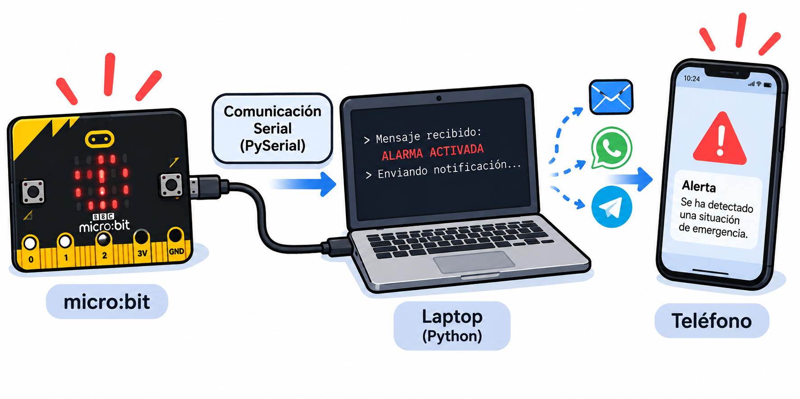

## 03/09/2026 — Cuarta clase

Durante esta clase se continuó trabajando con **GitHub**, realizando una mejor integración con **Visual Studio Code**. El profesor explicó y mostró cómo utilizar ambas herramientas de una manera más organizada, facilitando la edición, actualización y gestión de los archivos del proyecto dentro del repositorio.

Además, se trabajó en el diseño de la **imagen principal del proyecto**, que será utilizada como elemento representativo dentro del repositorio y la documentación.

También se realizó una actualización del **Informe de Avance 1**, incorporando y organizando los avances desarrollados hasta el momento. El informe, que anteriormente había sido subido al repositorio en formato **PDF**, fue revisado y actualizado con la información correspondiente al estado actual del proyecto.

Como resultado de esta clase, se mejoró la organización del repositorio, se incorporó la imagen principal del proyecto y se actualizó la documentación correspondiente al **Informe de Avance 1**, dejando registrado el trabajo realizado hasta el momento.

---

## 17/09/2026 — Quinta clase

Durante esta clase se continuó avanzando en el desarrollo del sistema de alarma. En primer lugar, se realizaron **correcciones en el código** desarrollado anteriormente y se incorporó un **nuevo sonido para la alarma**, mejorando el funcionamiento de la alerta.

Luego se comenzó a trabajar en la **comunicación serial entre la micro:bit y la computadora**. Se planteó conectar uno de los dispositivos directamente a la laptop y utilizar **PySerial** para permitir que la computadora pueda recibir y procesar los mensajes enviados por la micro:bit.

A partir de esta comunicación, se analizó la posibilidad de utilizar la computadora como intermediaria para tomar decisiones cuando se detecte una situación de alerta. La idea es que, al recibir el mensaje proveniente de la micro:bit, la laptop pueda generar automáticamente una **notificación hacia un teléfono**, utilizando algún medio de comunicación como correo electrónico, WhatsApp o Telegram.

También se consideró el uso de **Bluetooth** y otras alternativas de comunicación entre la computadora y los teléfonos, con el objetivo de determinar qué método resulta más adecuado para implementar el envío de las alertas.

  

Hasta el momento, **no se han podido realizar correctamente todas las pruebas previstas**, debido a que uno de los integrantes del equipo sufrió el **robo de parte de los materiales utilizados para el proyecto**. Esta situación afectó temporalmente el desarrollo de las pruebas y generó la necesidad de reorganizar el trabajo para poder continuar con el proyecto.

A pesar de esta dificultad, se continuó avanzando en el desarrollo y planificación del sistema, buscando alternativas que permitan retomar las pruebas y continuar con las siguientes etapas del proyecto.

---

